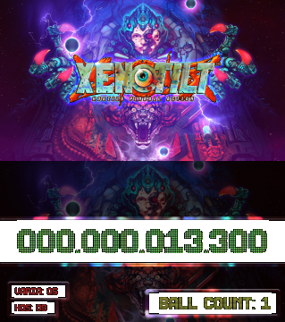
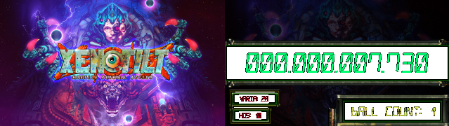
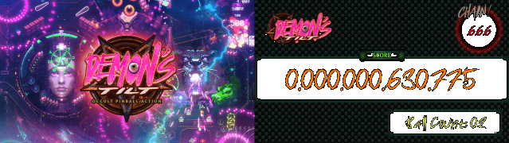

# DMD Display for XENOTILT (and other games!)

## Overview
This script creates a Dynamic Message Display (DMD) and backglass display for [**XENOTILT**](https://store.steampowered.com/app/2008980/XENOTILT_HOSTILE_PINBALL_ACTION/) and [**DEMON'S TILT**](https://store.steampowered.com/app/422510/DEMONS_TILT/) by reading memory values from the game and displaying them using a graphical interface. The application extracts game data such as the score, ball count, and additional display values and presents them in a custom-styled UI.







(The fonts used in the screenshot are [The Led Display ST](https://www.dafont.com/the-led-display-st.font) by Southype, [Digital-7](https://www.dafont.com/digital-7.font) by Style-7 and [Satanic Demon](https://www.dafont.com/satanic-demon.font) by Chris Hansen.)

See it in action on [YouTube](https://www.youtube.com/watch?v=AlW3EWoYUPo).

## Features
- Reads live memory values from the designated executable.
- Displays score, ball count, and additional game data.
- Creates a **DMD** window and a separate **Backglass** display.
- Uses a **configuration file** (`config.cfg`) for easy customization.
- Supports custom fonts for a pinball-style aesthetic.

## Requirements
### Python Dependencies

Install the requirements using pip:
```
pip install -r requirements.txt
```

Ensure you have the following installed:
```
pip install pymem pillow
```

### External Dependencies
- **XENOTILT**  must be running for the script to read memory values
- **config.cfg** (configuration file for UI customization)
- **background.png** (DMD background image)
- **wallpaper.png** (Backglass image)

## Configuration
The script reads from `config.cfg`, which defines settings for:
- **DMD settings** (size, position, background image, transparency)
- **Backglass settings** (size, position, image)
- **Display text colors and labels**
- **Memory addresses and offsets** for reading game data

Example config.cfg (remove the comments before using it, or use the example file from the repository):
```ini
; DMD (Dot Matrix Display) settings
[DMD]
dmd_enabled = true                  ; Enable or disable the DMD display (true or false)
dmd_width = 1280                    ; Width of the DMD window
dmd_height = 720                    ; Height of the DMD window
dmd_x = 1290                        ; X position of the DMD window on the screen
dmd_y = 0                           ; Y position of the DMD window
dmd_bg = background.png             ; Background image for the DMD
bg_alpha = 255                      ; Transparency level (0-255, where 255 is fully opaque)
font_name = Digital Counter 7       ; Font used for text in the DMD (Must be installed on the system)

; Backglass settings
[BACKGLASS]
enabled = true                      ; Enable or disable the backglass display (true or false)
back_x = 10                         ; X position of the backglass window
back_y = 0                          ; Y position of the backglass window
back_width = 1280                   ; Width of the backglass window
back_height = 720                   ; Height of the backglass window
backglass_bg = wallpaper.png        ; Background image for the backglass

; Positioning, labels annd appearance of the information shown in the DMD
; All positions are a percentage of the window size (0 is all the way to the left/top, 1 is all the way to the right/bottom). The X and Y are for the center of the text.
[DISPLAYS]
score_color = #00ff73             ; Color of the score text
score_x = 50                        ; X position of the score text
score_y = 50                        ; Y position of the score text
score_size = 100                    ; Font size of the score text
ball_count_enabled = true           ; Enable or disable the ball count display (true or false)
ball_count_label = ball count:      ; Label before the ball count
ball_count_color = #e8f15d        ; Color of the ball count text
ball_count_x = 74.5                 ; X position of the ball count text (relative, 0 is all the way to the left, 1 is all the way to the right)
ball_count_y = 89                   ; Y position of the ball count text (relative, 0 is at the top, 1 is at the bottom)
ball_count_size = 52                ; Font size of the ball count text
disp1_enabled = true                ; Enable or disable the first display field (true or false)
disp1_x = 13                        ; X position of the first display field
disp1_y = 78.5                      ; Y position of the first display field
disp1_size = 27                     ; Font size of the first display field
disp1_label = varia:                ; Label before the first display field
disp1_color = #f6001D             ; Color of the first display field
disp2_enabled = true                ; Enable or disable the second display field (true or false)
disp2_x = 11                        ; X position of the second display field
disp2_y = 91.6                      ; Y position of the second display field
disp2_size = 27                     ; Font size of the second display field
disp2_label = hos:                  ; Label for the second display field
disp2_color = #f6001D             ; Color of the second display field

; Memory configuration for reading game data (you can find these values using Cheat Engine or similar tools)
; Example values are for the current steam version of "XenoTilt"
[MEMORY]
process_name = XENOTILT.exe         ; Name of the game executable
module_name = mono-2.0-bdwgc.dll    ; Main module name for memory reading
module2_name = UnityPlayer.dll      ; Secondary module name
base_address = 0x0074A0B8           ; Base memory address for reading values
offsets = 0x30,0xE88                ; Offsets for locating the score value
ball_count_base = 0x01D21378        ; Base address for ball count
ball_count_offsets = 0x0,0x58,0x0,0xC0,0x28,0x38,0x670  ; Offsets for ball count
disp1_base = 0x01D047E8             ; Base address for first display field value
disp1_offsets = 0xD0,0x8,0x68,0x30,0xB8,0x2A0,0x170  ; Offsets for the first display field
disp2_base = 0x00754850             ; Base address for second display field value
disp2_offsets = 0x198,0x410,0x850,0x120,0xB0  ; Offsets for the second display field
```

## Usage
Run the script to start the DMD and backglass display:
```
python xenodmd.py
```
Press `ESC` to exit the UI.

## How It Works
1. **Loads configuration values** from `config.cfg`.
2. **Creates GUI windows** using Tkinter.
3. **Reads game memory** using `pymem`.
4. **Formats and updates** the display in real-time.

## Troubleshooting
- **No values updating?** Ensure that **XENOTILT.exe** is running.
    - The current values in the example work for my version of the game. You may need to adjust the memory addresses and offsets in `config.cfg`.
    - If you need to calculate your pointers and offsets, use a tool like [Cheat Engine](https://www.youtube.com/watch?v=CVDi-oIOxSo) to find the correct values.

- **Incorrect colors/fonts?** Modify `config.cfg` to adjust settings.
- **Crashes on startup?** Ensure required images (`background.png`, `wallpaper.png`) exist in the script directory.

## License
[CC BY-SA 4.0](https://creativecommons.org/licenses/by-sa/4.0/)

## Credits
Developed for enhancing pinball gameplay experience. Contributions welcome!

