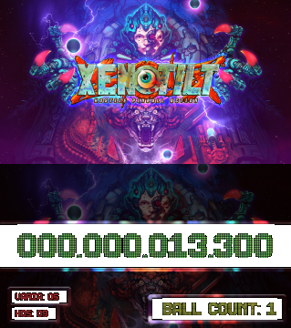

# DMD Display for XENOTILT

## Overview
This script creates a Dynamic Message Display (DMD) and backglass display for **XENOTILT** by reading memory values from the game and displaying them using a graphical interface. The application extracts game data such as the score, ball count, and additional display values and presents them in a custom-styled UI.



(The font used in the screenshot is [The Led Display ST](https://www.dafont.com/the-led-display-st.font) by Southype.)

## Features
- Reads live memory values from **XENOTILT**.
- Displays score, ball count, and additional game data.
- Creates a **DMD** window and a separate **Backglass** display.
- Uses a **configuration file** (`config.cfg`) for easy customization.
- Supports custom fonts for a pinball-style aesthetic.

## Requirements
### Python Dependencies

Install the requirements using pip:
```
pip install -r requirements.txt
```

Ensure you have the following installed:
```
pip install pymem pillow
```

### External Dependencies
- **XENOTILT**  must be running for the script to read memory values
- **config.cfg** (configuration file for UI customization)
- **background.png** (DMD background image)
- **wallpaper.png** (Backglass image)

## Configuration
The script reads from `config.cfg`, which defines settings for:
- **DMD settings** (size, position, background image, transparency)
- **Backglass settings** (size, position, image)
- **Display text colors and labels**
- **Memory addresses and offsets** for reading game data

Example config.cfg:
```ini
[DMD]
dmd_width = 1280
dmd_height = 720
dmd_x = 10
dmd_y = 720
dmd_text_scale = 12
dmd_bg = background.png
bg_alpha = 255
font_name = The Led Display ST

[BACKGLASS]
back_x = 10
back_y = 0
back_width = 1280
back_height = 720
backglass_bg = wallpaper.png

[DISPLAYS]
score_color = #95f184
ball_count_label = ball count:
ball_count_color = #e8f15d
disp1_x = 0.065
disp1_y = 0.75
disp1_size = 20
disp1_label = varia:
disp1_color = #ff4444
disp2_x = 0.065
disp2_y = 0.88
disp2_size = 20
disp2_label = hos:
disp2_color = #ff4444

[MEMORY]
process_name = XENOTILT.exe
module_name = mono-2.0-bdwgc.dll
module2_name = UnityPlayer.dll
base_address = 0x0074A0B8
offsets = 0x30,0xE88
ball_count_base = 0x01D21378
ball_count_offsets = 0x0,0x58,0x0,0xC0,0x28,0x38,0x670
disp1_base = 0x01D047E8
disp1_offsets = 0xD0,0x8,0x68,0x30,0xB8,0x2A0,0x170
disp2_base = 0x00754850
disp2_offsets = 0x198,0x410,0x850,0x120,0xB0
```

## Usage
Run the script to start the DMD and backglass display:
```
python xenodmd.py
```
Press `ESC` to exit the UI.

## How It Works
1. **Loads configuration values** from `config.cfg`.
2. **Creates GUI windows** using Tkinter.
3. **Reads game memory** using `pymem`.
4. **Formats and updates** the display in real-time.

## Troubleshooting
- **No values updating?** Ensure that **XENOTILT.exe** is running.
    - The current values in the example work for my version of the game. You may need to adjust the memory addresses and offsets in `config.cfg`.
    - If you need to calculate your pointers and offsets, use a tool like [Cheat Engine](https://www.youtube.com/watch?v=CVDi-oIOxSo) to find the correct values.

- **Incorrect colors/fonts?** Modify `config.cfg` to adjust settings.
- **Crashes on startup?** Ensure required images (`background.png`, `wallpaper.png`) exist in the script directory.

## License
[CC BY-SA 4.0](https://creativecommons.org/licenses/by-sa/4.0/)

## Credits
Developed for enhancing pinball gameplay experience. Contributions welcome!

